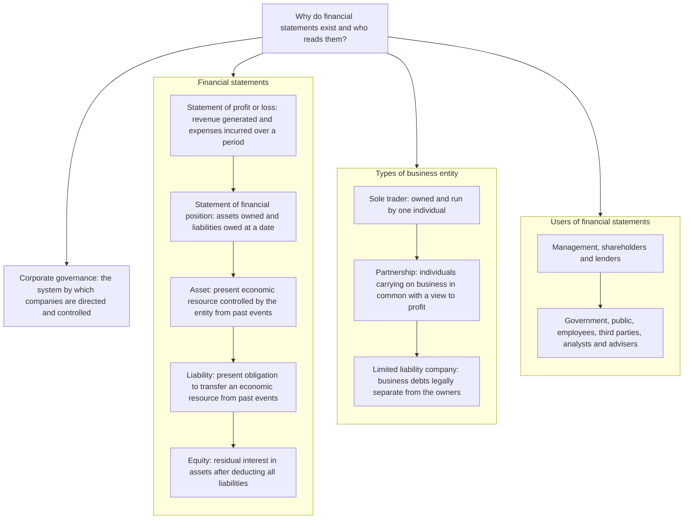

```mermaid
flowchart TB
    R["Why do financial statements exist and who reads them?"]

    subgraph FSB["Financial statements"]
        direction TB
        FS1["Statement of profit or loss: revenue generated and expenses incurred over a period"]
        FS2["Statement of financial position: assets owned and liabilities owed at a date"]
        FS3["Asset: present economic resource controlled by the entity from past events"]
        FS4["Liability: present obligation to transfer an economic resource from past events"]
        FS5["Equity: residual interest in assets after deducting all liabilities"]

        FS1 --> FS2
        FS2 --> FS3
        FS3 --> FS4
        FS4 --> FS5
    end

    subgraph ENT["Types of business entity"]
        direction TB
        EN1["Sole trader: owned and run by one individual"]
        EN2["Partnership: individuals carrying on business in common with a view to profit"]
        EN3["Limited liability company: business debts legally separate from the owners"]

        EN1 --> EN2
        EN2 --> EN3
    end

    subgraph USR["Users of financial statements"]
        direction TB
        US1["Management, shareholders and lenders"]
        US2["Government, public, employees, third parties, analysts and advisers"]

        US1 --> US2
    end

    CG["Corporate governance: the system by which companies are directed and controlled"]

    R --> FSB
    R --> ENT
    R --> USR
    R --> CG
```
