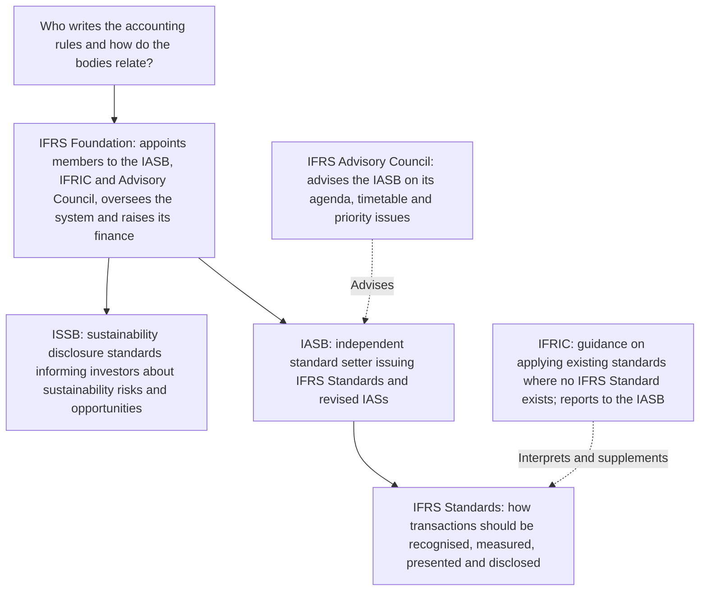

```mermaid
flowchart TB
    R["Who writes the accounting rules and how do the bodies relate?"]

    IFRSF["IFRS Foundation: appoints members to the IASB, IFRIC and Advisory Council, oversees the system and raises its finance"]
    IASB["IASB: independent standard setter issuing IFRS Standards and revised IASs"]
    ISSB["ISSB: sustainability disclosure standards informing investors about sustainability risks and opportunities"]
    AC["IFRS Advisory Council: advises the IASB on its agenda, timetable and priority issues"]
    IFRIC["IFRIC: guidance on applying existing standards where no IFRS Standard exists; reports to the IASB"]
    STD["IFRS Standards: how transactions should be recognised, measured, presented and disclosed"]

    R --> IFRSF
    IFRSF --> IASB
    IFRSF --> ISSB
    AC -. "Advises" .-> IASB
    IASB --> STD
    IFRIC -. "Interprets and supplements" .-> STD
```
