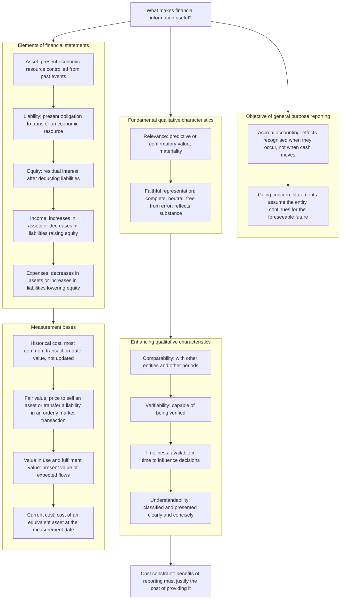

```mermaid
flowchart TB
    R["What makes financial information useful?"]

    subgraph OBJ["Objective of general purpose reporting"]
        direction TB
        OB1["Accrual accounting: effects recognised when they occur, not when cash moves"]
        OB2["Going concern: statements assume the entity continues for the foreseeable future"]

        OB1 --> OB2
    end

    subgraph FUND["Fundamental qualitative characteristics"]
        direction TB
        FU1["Relevance: predictive or confirmatory value; materiality"]
        FU2["Faithful representation: complete, neutral, free from error; reflects substance"]

        FU1 --> FU2
    end

    subgraph ENH["Enhancing qualitative characteristics"]
        direction TB
        EN1["Comparability: with other entities and other periods"]
        EN2["Verifiability: capable of being verified"]
        EN3["Timeliness: available in time to influence decisions"]
        EN4["Understandability: classified and presented clearly and concisely"]

        EN1 --> EN2
        EN2 --> EN3
        EN3 --> EN4
    end

    COST["Cost constraint: benefits of reporting must justify the cost of providing it"]

    subgraph ELEM["Elements of financial statements"]
        direction TB
        EL1["Asset: present economic resource controlled from past events"]
        EL2["Liability: present obligation to transfer an economic resource"]
        EL3["Equity: residual interest after deducting liabilities"]
        EL4["Income: increases in assets or decreases in liabilities raising equity"]
        EL5["Expenses: decreases in assets or increases in liabilities lowering equity"]

        EL1 --> EL2
        EL2 --> EL3
        EL3 --> EL4
        EL4 --> EL5
    end

    subgraph MEAS["Measurement bases"]
        direction TB
        ME1["Historical cost: most common; transaction-date value, not updated"]
        ME2["Fair value: price to sell an asset or transfer a liability in an orderly market transaction"]
        ME3["Value in use and fulfilment value: present value of expected flows"]
        ME4["Current cost: cost of an equivalent asset at the measurement date"]

        ME1 --> ME2
        ME2 --> ME3
        ME3 --> ME4
    end

    R --> OBJ
    R --> FUND
    FUND --> ENH
    ENH --> COST
    R --> ELEM
    ELEM --> MEAS
```
