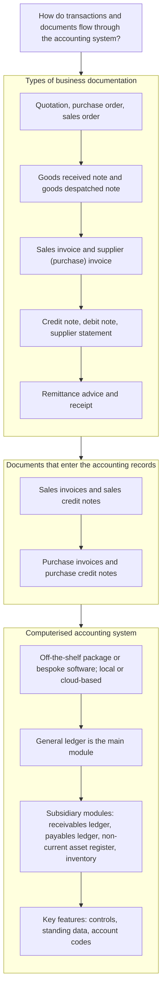

```mermaid
flowchart TB
    R["How do transactions and documents flow through the accounting system?"]

    subgraph DOC["Types of business documentation"]
        direction TB
        DO1["Quotation, purchase order, sales order"]
        DO2["Goods received note and goods despatched note"]
        DO3["Sales invoice and supplier (purchase) invoice"]
        DO4["Credit note, debit note, supplier statement"]
        DO5["Remittance advice and receipt"]

        DO1 --> DO2
        DO2 --> DO3
        DO3 --> DO4
        DO4 --> DO5
    end

    subgraph REC["Documents that enter the accounting records"]
        direction TB
        RE1["Sales invoices and sales credit notes"]
        RE2["Purchase invoices and purchase credit notes"]

        RE1 --> RE2
    end

    subgraph SYS["Computerised accounting system"]
        direction TB
        SY1["Off-the-shelf package or bespoke software; local or cloud-based"]
        SY2["General ledger is the main module"]
        SY3["Subsidiary modules: receivables ledger, payables ledger, non-current asset register, inventory"]
        SY4["Key features: controls, standing data, account codes"]

        SY1 --> SY2
        SY2 --> SY3
        SY3 --> SY4
    end

    R --> DOC
    DOC --> REC
    REC --> SYS
```
