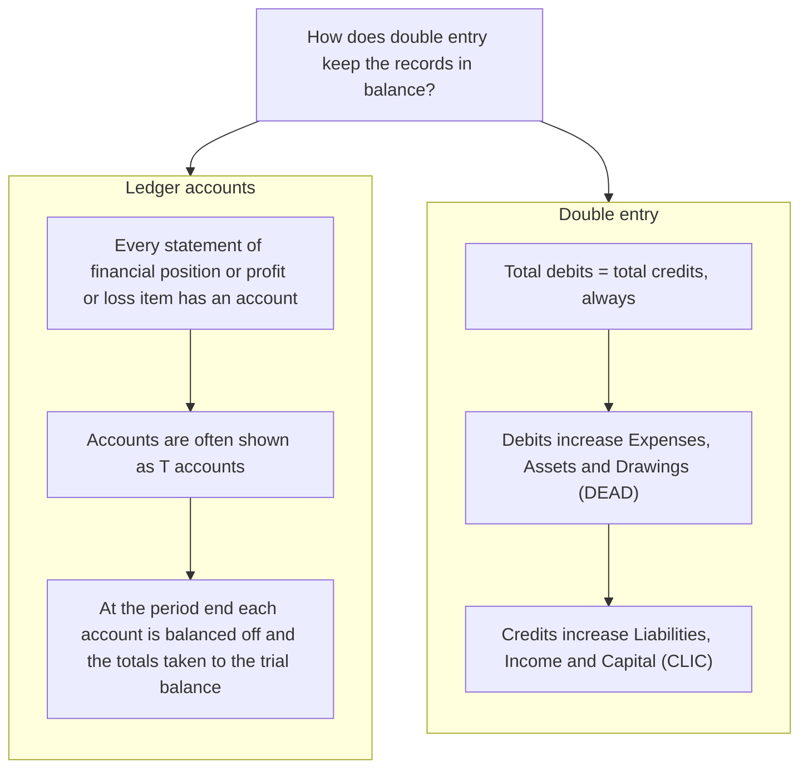

```mermaid
flowchart TB
    R["How does double entry keep the records in balance?"]

    subgraph LED["Ledger accounts"]
        direction TB
        LE1["Every statement of financial position or profit or loss item has an account"]
        LE2["Accounts are often shown as T accounts"]
        LE3["At the period end each account is balanced off and the totals taken to the trial balance"]

        LE1 --> LE2
        LE2 --> LE3
    end

    subgraph DE["Double entry"]
        direction TB
        DE1["Total debits = total credits, always"]
        DE2["Debits increase Expenses, Assets and Drawings (DEAD)"]
        DE3["Credits increase Liabilities, Income and Capital (CLIC)"]

        DE1 --> DE2
        DE2 --> DE3
    end

    R --> LED
    R --> DE
```
