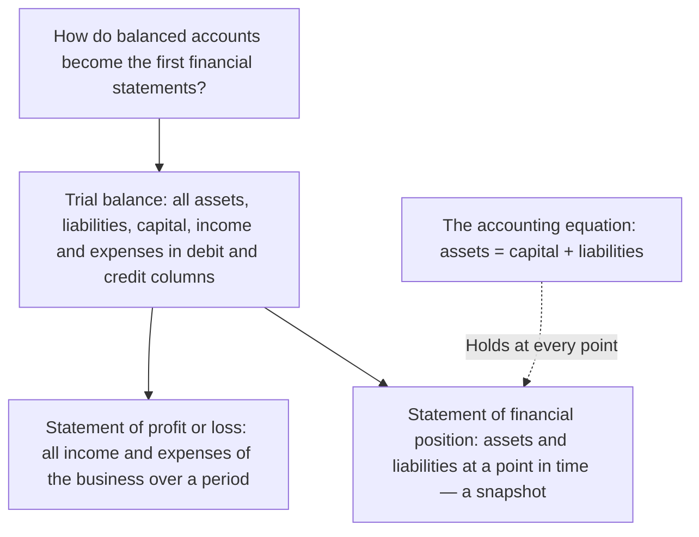

```mermaid
flowchart TB
    R["How do balanced accounts become the first financial statements?"]

    TB1["Trial balance: all assets, liabilities, capital, income and expenses in debit and credit columns"]
    PL["Statement of profit or loss: all income and expenses of the business over a period"]
    FP["Statement of financial position: assets and liabilities at a point in time — a snapshot"]
    EQ["The accounting equation: assets = capital + liabilities"]

    R --> TB1
    TB1 --> PL
    TB1 --> FP
    EQ -. "Holds at every point" .-> FP
```
