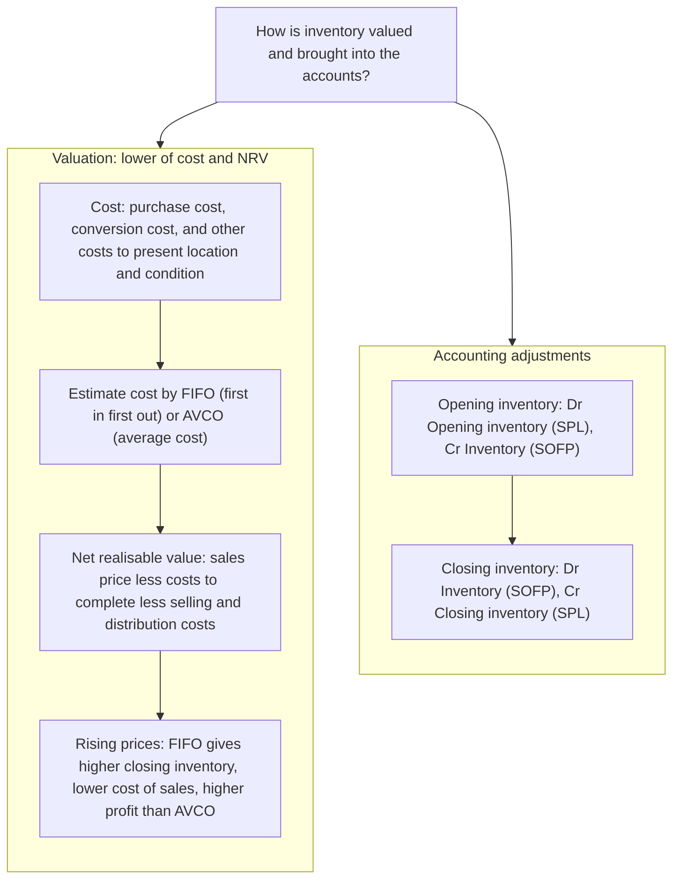

```mermaid
flowchart TB
    R["How is inventory valued and brought into the accounts?"]

    subgraph VAL["Valuation: lower of cost and NRV"]
        direction TB
        VA1["Cost: purchase cost, conversion cost, and other costs to present location and condition"]
        VA2["Estimate cost by FIFO (first in first out) or AVCO (average cost)"]
        VA3["Net realisable value: sales price less costs to complete less selling and distribution costs"]
        VA4["Rising prices: FIFO gives higher closing inventory, lower cost of sales, higher profit than AVCO"]

        VA1 --> VA2
        VA2 --> VA3
        VA3 --> VA4
    end

    subgraph ADJ["Accounting adjustments"]
        direction TB
        AD1["Opening inventory: Dr Opening inventory (SPL), Cr Inventory (SOFP)"]
        AD2["Closing inventory: Dr Inventory (SOFP), Cr Closing inventory (SPL)"]

        AD1 --> AD2
    end

    R --> VAL
    R --> ADJ
```
