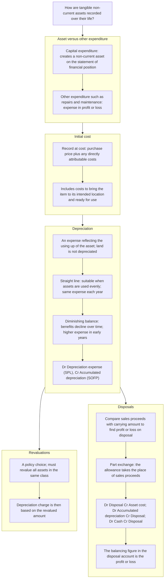

```mermaid
flowchart TB
    R["How are tangible non-current assets recorded over their life?"]

    subgraph EXP["Asset versus other expenditure"]
        direction TB
        EX1["Capital expenditure: creates a non-current asset on the statement of financial position"]
        EX2["Other expenditure such as repairs and maintenance: expense in profit or loss"]

        EX1 --> EX2
    end

    subgraph CST["Initial cost"]
        direction TB
        CS1["Record at cost: purchase price plus any directly attributable costs"]
        CS2["Includes costs to bring the item to its intended location and ready for use"]

        CS1 --> CS2
    end

    subgraph DEP["Depreciation"]
        direction TB
        DP1["An expense reflecting the using up of the asset; land is not depreciated"]
        DP2["Straight line: suitable when assets are used evenly; same expense each year"]
        DP3["Diminishing balance: benefits decline over time; higher expense in early years"]
        DP4["Dr Depreciation expense (SPL), Cr Accumulated depreciation (SOFP)"]

        DP1 --> DP2
        DP2 --> DP3
        DP3 --> DP4
    end

    subgraph REV["Revaluations"]
        direction TB
        RV1["A policy choice; must revalue all assets in the same class"]
        RV2["Depreciation charge is then based on the revalued amount"]

        RV1 --> RV2
    end

    subgraph DIS["Disposals"]
        direction TB
        DI1["Compare sales proceeds with carrying amount to find profit or loss on disposal"]
        DI2["Part exchange: the allowance takes the place of sales proceeds"]
        DI3["Dr Disposal Cr Asset cost; Dr Accumulated depreciation Cr Disposal; Dr Cash Cr Disposal"]
        DI4["The balancing figure in the disposal account is the profit or loss"]

        DI1 --> DI2
        DI2 --> DI3
        DI3 --> DI4
    end

    R --> EXP
    EXP --> CST
    CST --> DEP
    DEP --> REV
    DEP --> DIS
```
