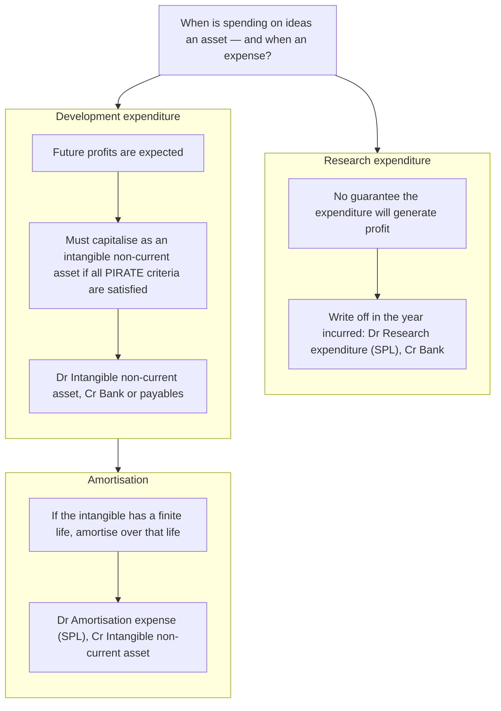

```mermaid
flowchart TB
    R["When is spending on ideas an asset — and when an expense?"]

    subgraph RES["Research expenditure"]
        direction TB
        RS1["No guarantee the expenditure will generate profit"]
        RS2["Write off in the year incurred: Dr Research expenditure (SPL), Cr Bank"]

        RS1 --> RS2
    end

    subgraph DEV["Development expenditure"]
        direction TB
        DV1["Future profits are expected"]
        DV2["Must capitalise as an intangible non-current asset if all PIRATE criteria are satisfied"]
        DV3["Dr Intangible non-current asset, Cr Bank or payables"]

        DV1 --> DV2
        DV2 --> DV3
    end

    subgraph AMO["Amortisation"]
        direction TB
        AM1["If the intangible has a finite life, amortise over that life"]
        AM2["Dr Amortisation expense (SPL), Cr Intangible non-current asset"]

        AM1 --> AM2
    end

    R --> RES
    R --> DEV
    DEV --> AMO
```
