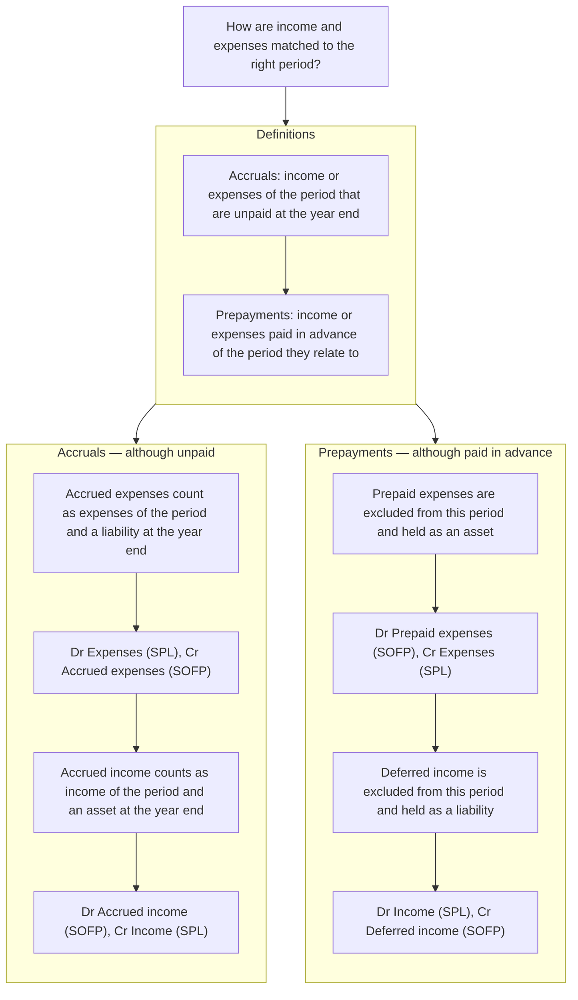

```mermaid
flowchart TB
    R["How are income and expenses matched to the right period?"]

    subgraph DEF["Definitions"]
        direction TB
        DF1["Accruals: income or expenses of the period that are unpaid at the year end"]
        DF2["Prepayments: income or expenses paid in advance of the period they relate to"]

        DF1 --> DF2
    end

    subgraph ACC["Accruals — although unpaid"]
        direction TB
        AC1["Accrued expenses count as expenses of the period and a liability at the year end"]
        AC2["Dr Expenses (SPL), Cr Accrued expenses (SOFP)"]
        AC3["Accrued income counts as income of the period and an asset at the year end"]
        AC4["Dr Accrued income (SOFP), Cr Income (SPL)"]

        AC1 --> AC2
        AC2 --> AC3
        AC3 --> AC4
    end

    subgraph PRE["Prepayments — although paid in advance"]
        direction TB
        PR1["Prepaid expenses are excluded from this period and held as an asset"]
        PR2["Dr Prepaid expenses (SOFP), Cr Expenses (SPL)"]
        PR3["Deferred income is excluded from this period and held as a liability"]
        PR4["Dr Income (SPL), Cr Deferred income (SOFP)"]

        PR1 --> PR2
        PR2 --> PR3
        PR3 --> PR4
    end

    R --> DEF
    DEF --> ACC
    DEF --> PRE
```
