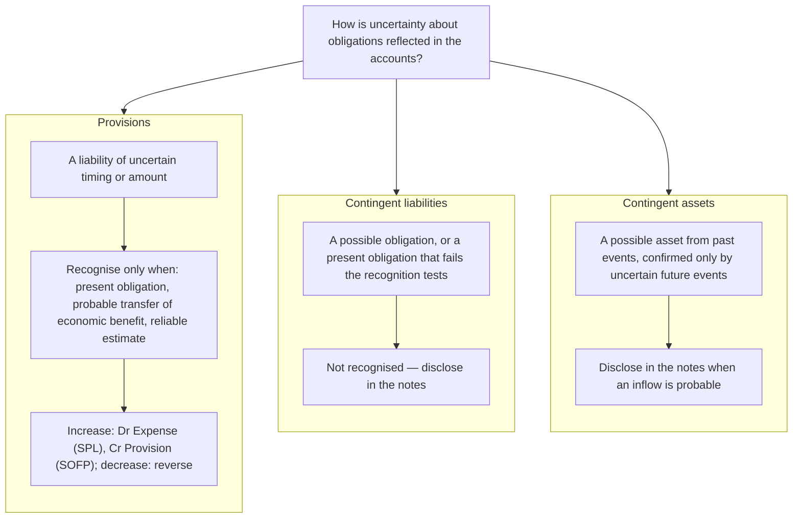

```mermaid
flowchart TB
    R["How is uncertainty about obligations reflected in the accounts?"]

    subgraph PRO["Provisions"]
        direction TB
        PV1["A liability of uncertain timing or amount"]
        PV2["Recognise only when: present obligation, probable transfer of economic benefit, reliable estimate"]
        PV3["Increase: Dr Expense (SPL), Cr Provision (SOFP); decrease: reverse"]

        PV1 --> PV2
        PV2 --> PV3
    end

    subgraph CL["Contingent liabilities"]
        direction TB
        CL1["A possible obligation, or a present obligation that fails the recognition tests"]
        CL2["Not recognised — disclose in the notes"]

        CL1 --> CL2
    end

    subgraph CA["Contingent assets"]
        direction TB
        CA1["A possible asset from past events, confirmed only by uncertain future events"]
        CA2["Disclose in the notes when an inflow is probable"]

        CA1 --> CA2
    end

    R --> PRO
    R --> CL
    R --> CA
```
