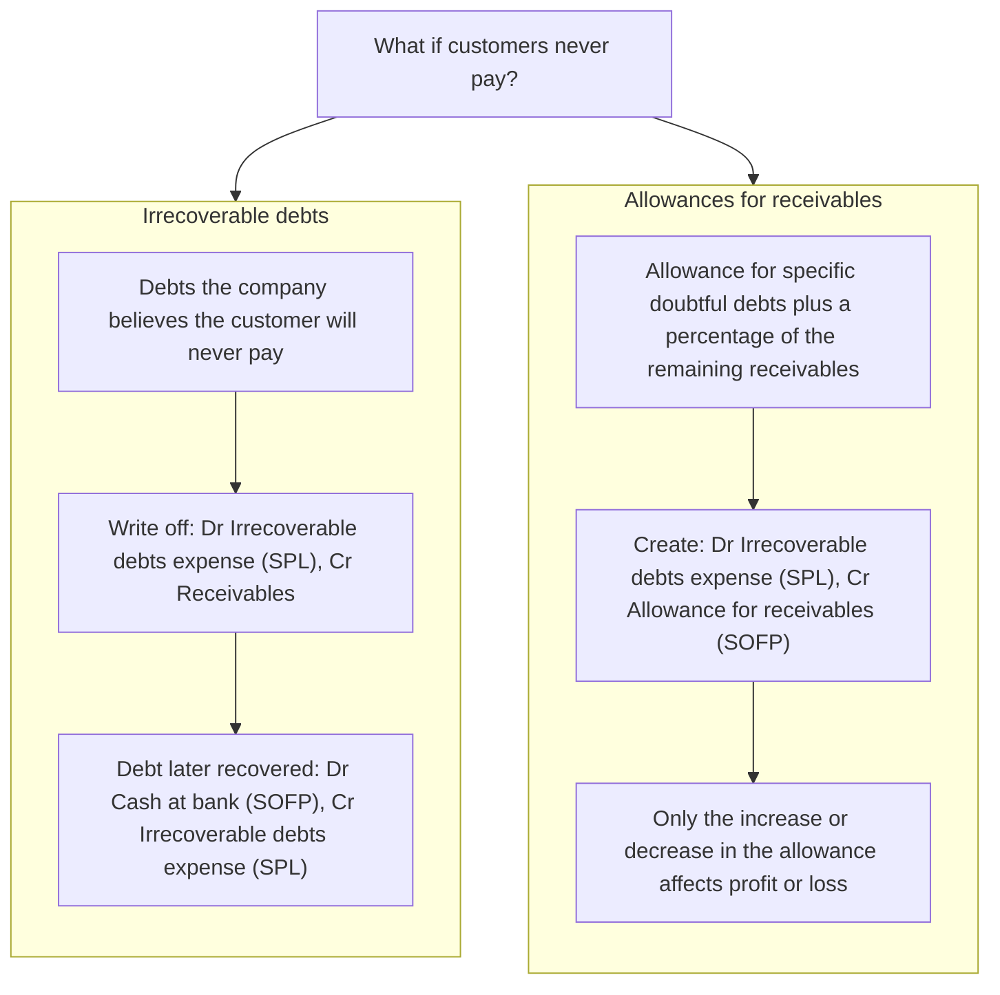

```mermaid
flowchart TB
    R["What if customers never pay?"]

    subgraph IRR["Irrecoverable debts"]
        direction TB
        IR1["Debts the company believes the customer will never pay"]
        IR2["Write off: Dr Irrecoverable debts expense (SPL), Cr Receivables"]
        IR3["Debt later recovered: Dr Cash at bank (SOFP), Cr Irrecoverable debts expense (SPL)"]

        IR1 --> IR2
        IR2 --> IR3
    end

    subgraph ALL["Allowances for receivables"]
        direction TB
        AL1["Allowance for specific doubtful debts plus a percentage of the remaining receivables"]
        AL2["Create: Dr Irrecoverable debts expense (SPL), Cr Allowance for receivables (SOFP)"]
        AL3["Only the increase or decrease in the allowance affects profit or loss"]

        AL1 --> AL2
        AL2 --> AL3
    end

    R --> IRR
    R --> ALL
```
