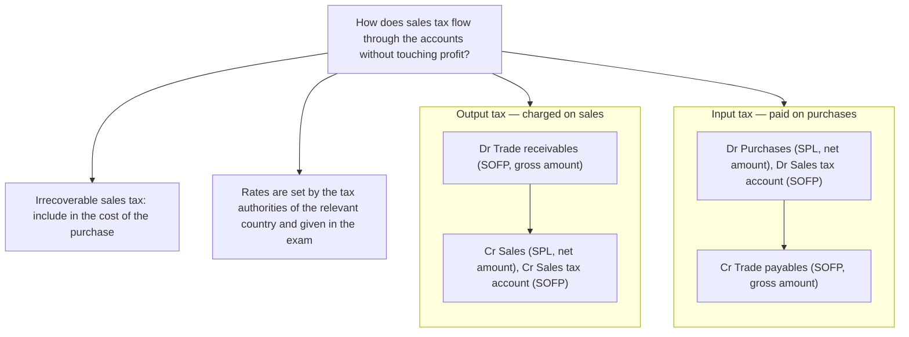

```mermaid
flowchart TB
    R["How does sales tax flow through the accounts without touching profit?"]

    subgraph OUT["Output tax — charged on sales"]
        direction TB
        OU1["Dr Trade receivables (SOFP, gross amount)"]
        OU2["Cr Sales (SPL, net amount), Cr Sales tax account (SOFP)"]

        OU1 --> OU2
    end

    subgraph INP["Input tax — paid on purchases"]
        direction TB
        IN1["Dr Purchases (SPL, net amount), Dr Sales tax account (SOFP)"]
        IN2["Cr Trade payables (SOFP, gross amount)"]

        IN1 --> IN2
    end

    IRRT["Irrecoverable sales tax: include in the cost of the purchase"]
    RATE["Rates are set by the tax authorities of the relevant country and given in the exam"]

    R --> OUT
    R --> INP
    R --> IRRT
    R --> RATE
```
