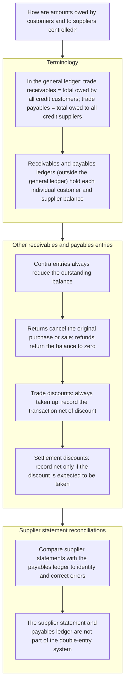

```mermaid
flowchart TB
    R["How are amounts owed by customers and to suppliers controlled?"]

    subgraph TER["Terminology"]
        direction TB
        TE1["In the general ledger: trade receivables = total owed by all credit customers; trade payables = total owed to all credit suppliers"]
        TE2["Receivables and payables ledgers (outside the general ledger) hold each individual customer and supplier balance"]

        TE1 --> TE2
    end

    subgraph OTH["Other receivables and payables entries"]
        direction TB
        OT1["Contra entries always reduce the outstanding balance"]
        OT2["Returns cancel the original purchase or sale; refunds return the balance to zero"]
        OT3["Trade discounts: always taken up; record the transaction net of discount"]
        OT4["Settlement discounts: record net only if the discount is expected to be taken"]

        OT1 --> OT2
        OT2 --> OT3
        OT3 --> OT4
    end

    subgraph SUP["Supplier statement reconciliations"]
        direction TB
        SU1["Compare supplier statements with the payables ledger to identify and correct errors"]
        SU2["The supplier statement and payables ledger are not part of the double-entry system"]

        SU1 --> SU2
    end

    R --> TER
    TER --> OTH
    OTH --> SUP
```
