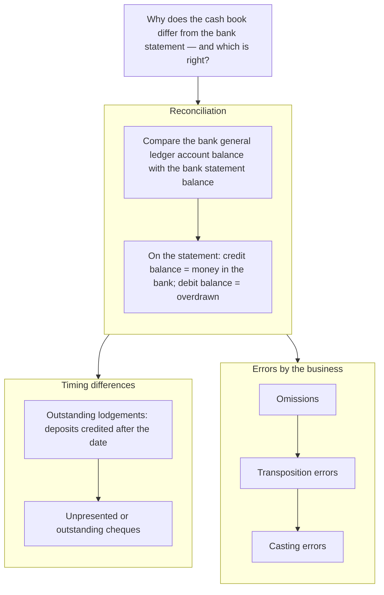

```mermaid
flowchart TB
    R["Why does the cash book differ from the bank statement — and which is right?"]

    subgraph REC["Reconciliation"]
        direction TB
        RC1["Compare the bank general ledger account balance with the bank statement balance"]
        RC2["On the statement: credit balance = money in the bank; debit balance = overdrawn"]

        RC1 --> RC2
    end

    subgraph TIM["Timing differences"]
        direction TB
        TI1["Outstanding lodgements: deposits credited after the date"]
        TI2["Unpresented or outstanding cheques"]

        TI1 --> TI2
    end

    subgraph ERR["Errors by the business"]
        direction TB
        ER1["Omissions"]
        ER2["Transposition errors"]
        ER3["Casting errors"]

        ER1 --> ER2
        ER2 --> ER3
    end

    R --> REC
    REC --> TIM
    REC --> ERR
```
