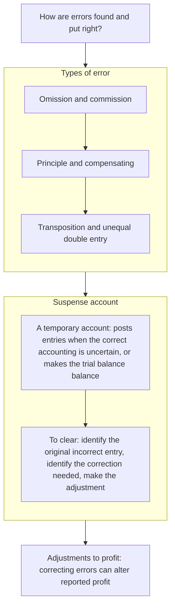

```mermaid
flowchart TB
    R["How are errors found and put right?"]

    subgraph TYP["Types of error"]
        direction TB
        TY1["Omission and commission"]
        TY2["Principle and compensating"]
        TY3["Transposition and unequal double entry"]

        TY1 --> TY2
        TY2 --> TY3
    end

    subgraph SUS["Suspense account"]
        direction TB
        SU1["A temporary account: posts entries when the correct accounting is uncertain, or makes the trial balance balance"]
        SU2["To clear: identify the original incorrect entry, identify the correction needed, make the adjustment"]

        SU1 --> SU2
    end

    ADJ["Adjustments to profit: correcting errors can alter reported profit"]

    R --> TYP
    TYP --> SUS
    SUS --> ADJ
```
