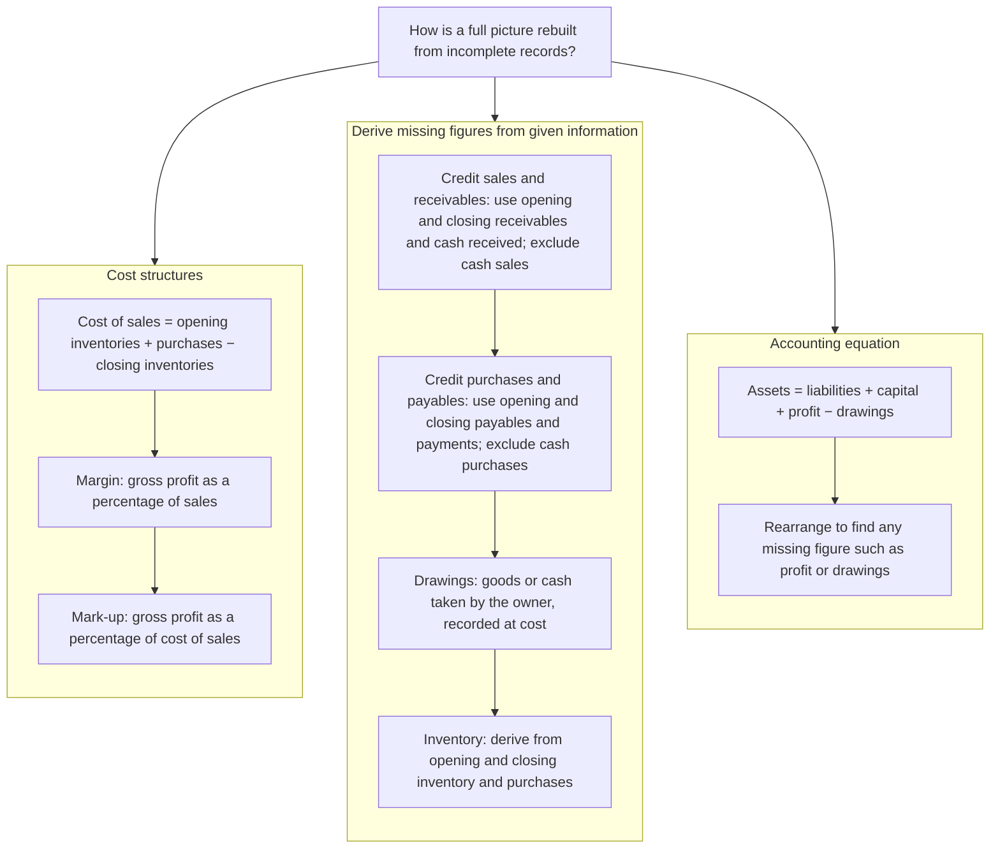

```mermaid
flowchart TB
    R["How is a full picture rebuilt from incomplete records?"]

    subgraph CST["Cost structures"]
        direction TB
        CS1["Cost of sales = opening inventories + purchases − closing inventories"]
        CS2["Margin: gross profit as a percentage of sales"]
        CS3["Mark-up: gross profit as a percentage of cost of sales"]

        CS1 --> CS2
        CS2 --> CS3
    end

    subgraph DER["Derive missing figures from given information"]
        direction TB
        DE1["Credit sales and receivables: use opening and closing receivables and cash received; exclude cash sales"]
        DE2["Credit purchases and payables: use opening and closing payables and payments; exclude cash purchases"]
        DE3["Drawings: goods or cash taken by the owner, recorded at cost"]
        DE4["Inventory: derive from opening and closing inventory and purchases"]

        DE1 --> DE2
        DE2 --> DE3
        DE3 --> DE4
    end

    subgraph AEQ["Accounting equation"]
        direction TB
        AE1["Assets = liabilities + capital + profit − drawings"]
        AE2["Rearrange to find any missing figure such as profit or drawings"]

        AE1 --> AE2
    end

    R --> CST
    R --> DER
    R --> AEQ
```
