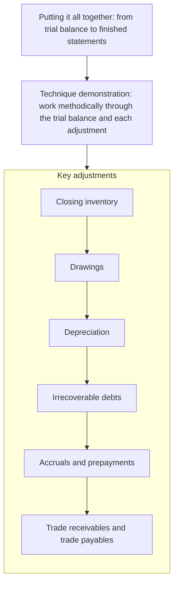

```mermaid
flowchart TB
    R["Putting it all together: from trial balance to finished statements"]

    TEC["Technique demonstration: work methodically through the trial balance and each adjustment"]

    subgraph ADJ["Key adjustments"]
        direction TB
        AD1["Closing inventory"]
        AD2["Drawings"]
        AD3["Depreciation"]
        AD4["Irrecoverable debts"]
        AD5["Accruals and prepayments"]
        AD6["Trade receivables and trade payables"]

        AD1 --> AD2
        AD2 --> AD3
        AD3 --> AD4
        AD4 --> AD5
        AD5 --> AD6
    end

    R --> TEC
    TEC --> ADJ
```
