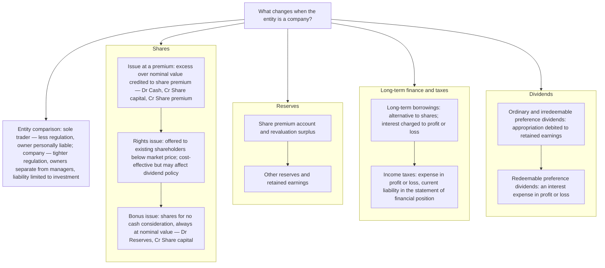

```mermaid
flowchart TB
    R["What changes when the entity is a company?"]

    subgraph SHA["Shares"]
        direction TB
        SH1["Issue at a premium: excess over nominal value credited to share premium — Dr Cash, Cr Share capital, Cr Share premium"]
        SH2["Rights issue: offered to existing shareholders below market price; cost-effective but may affect dividend policy"]
        SH3["Bonus issue: shares for no cash consideration, always at nominal value — Dr Reserves, Cr Share capital"]

        SH1 --> SH2
        SH2 --> SH3
    end

    subgraph RES["Reserves"]
        direction TB
        RE1["Share premium account and revaluation surplus"]
        RE2["Other reserves and retained earnings"]

        RE1 --> RE2
    end

    subgraph FIN["Long-term finance and taxes"]
        direction TB
        FI1["Long-term borrowings: alternative to shares; interest charged to profit or loss"]
        FI2["Income taxes: expense in profit or loss, current liability in the statement of financial position"]

        FI1 --> FI2
    end

    subgraph DIV["Dividends"]
        direction TB
        DV1["Ordinary and irredeemable preference dividends: appropriation debited to retained earnings"]
        DV2["Redeemable preference dividends: an interest expense in profit or loss"]

        DV1 --> DV2
    end

    CMP["Entity comparison: sole trader — less regulation, owner personally liable; company — tighter regulation, owners separate from managers, liability limited to investment"]

    R --> SHA
    R --> RES
    R --> FIN
    R --> DIV
    R --> CMP
```
