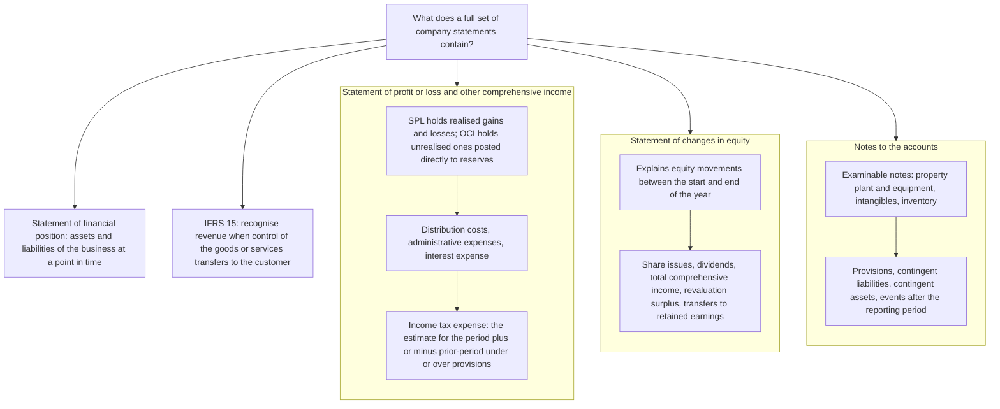

```mermaid
flowchart TB
    R["What does a full set of company statements contain?"]

    subgraph SPL["Statement of profit or loss and other comprehensive income"]
        direction TB
        SP1["SPL holds realised gains and losses; OCI holds unrealised ones posted directly to reserves"]
        SP2["Distribution costs, administrative expenses, interest expense"]
        SP3["Income tax expense: the estimate for the period plus or minus prior-period under or over provisions"]

        SP1 --> SP2
        SP2 --> SP3
    end

    FP["Statement of financial position: assets and liabilities of the business at a point in time"]

    subgraph CE["Statement of changes in equity"]
        direction TB
        CE1["Explains equity movements between the start and end of the year"]
        CE2["Share issues, dividends, total comprehensive income, revaluation surplus, transfers to retained earnings"]

        CE1 --> CE2
    end

    subgraph NT["Notes to the accounts"]
        direction TB
        NT1["Examinable notes: property plant and equipment, intangibles, inventory"]
        NT2["Provisions, contingent liabilities, contingent assets, events after the reporting period"]

        NT1 --> NT2
    end

    IFRS15["IFRS 15: recognise revenue when control of the goods or services transfers to the customer"]

    R --> SPL
    R --> FP
    R --> CE
    R --> NT
    R --> IFRS15
```
