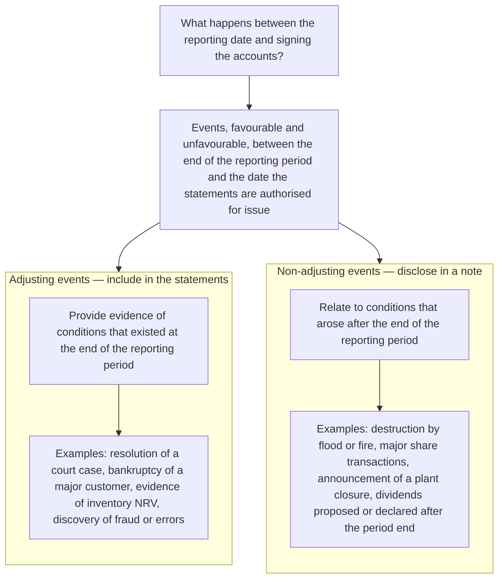

```mermaid
flowchart TB
    R["What happens between the reporting date and signing the accounts?"]

    DEF["Events, favourable and unfavourable, between the end of the reporting period and the date the statements are authorised for issue"]

    subgraph ADJ["Adjusting events — include in the statements"]
        direction TB
        AJ1["Provide evidence of conditions that existed at the end of the reporting period"]
        AJ2["Examples: resolution of a court case, bankruptcy of a major customer, evidence of inventory NRV, discovery of fraud or errors"]

        AJ1 --> AJ2
    end

    subgraph NON["Non-adjusting events — disclose in a note"]
        direction TB
        NA1["Relate to conditions that arose after the end of the reporting period"]
        NA2["Examples: destruction by flood or fire, major share transactions, announcement of a plant closure, dividends proposed or declared after the period end"]

        NA1 --> NA2
    end

    R --> DEF
    DEF --> ADJ
    DEF --> NON
```
