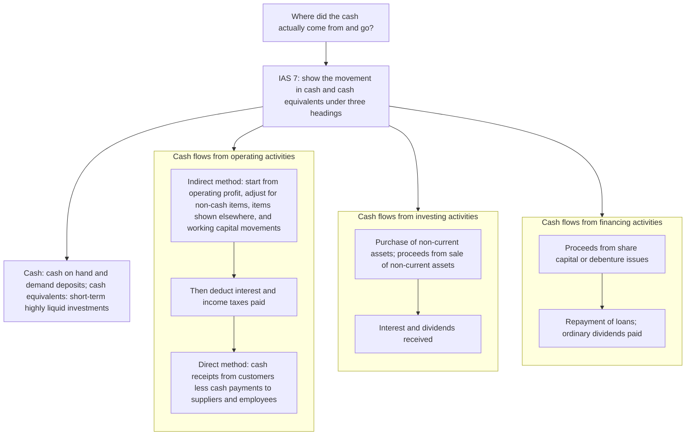

```mermaid
flowchart TB
    R["Where did the cash actually come from and go?"]

    IAS7["IAS 7: show the movement in cash and cash equivalents under three headings"]
    CE["Cash: cash on hand and demand deposits; cash equivalents: short-term highly liquid investments"]

    subgraph OPR["Cash flows from operating activities"]
        direction TB
        OP1["Indirect method: start from operating profit, adjust for non-cash items, items shown elsewhere, and working capital movements"]
        OP2["Then deduct interest and income taxes paid"]
        OP3["Direct method: cash receipts from customers less cash payments to suppliers and employees"]

        OP1 --> OP2
        OP2 --> OP3
    end

    subgraph INV["Cash flows from investing activities"]
        direction TB
        IV1["Purchase of non-current assets; proceeds from sale of non-current assets"]
        IV2["Interest and dividends received"]

        IV1 --> IV2
    end

    subgraph FIN["Cash flows from financing activities"]
        direction TB
        FN1["Proceeds from share capital or debenture issues"]
        FN2["Repayment of loans; ordinary dividends paid"]

        FN1 --> FN2
    end

    R --> IAS7
    IAS7 --> CE
    IAS7 --> OPR
    IAS7 --> INV
    IAS7 --> FIN
```
