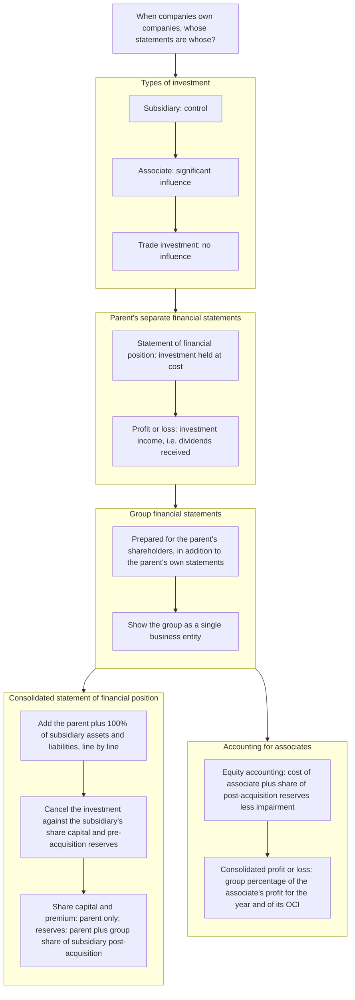

```mermaid
flowchart TB
    R["When companies own companies, whose statements are whose?"]

    subgraph TYP["Types of investment"]
        direction TB
        TY1["Subsidiary: control"]
        TY2["Associate: significant influence"]
        TY3["Trade investment: no influence"]

        TY1 --> TY2
        TY2 --> TY3
    end

    subgraph PAR["Parent's separate financial statements"]
        direction TB
        PA1["Statement of financial position: investment held at cost"]
        PA2["Profit or loss: investment income, i.e. dividends received"]

        PA1 --> PA2
    end

    subgraph GRP["Group financial statements"]
        direction TB
        GR1["Prepared for the parent's shareholders, in addition to the parent's own statements"]
        GR2["Show the group as a single business entity"]

        GR1 --> GR2
    end

    subgraph CFP["Consolidated statement of financial position"]
        direction TB
        CF1["Add the parent plus 100% of subsidiary assets and liabilities, line by line"]
        CF2["Cancel the investment against the subsidiary's share capital and pre-acquisition reserves"]
        CF3["Share capital and premium: parent only; reserves: parent plus group share of subsidiary post-acquisition"]

        CF1 --> CF2
        CF2 --> CF3
    end

    subgraph ASS["Accounting for associates"]
        direction TB
        AS1["Equity accounting: cost of associate plus share of post-acquisition reserves less impairment"]
        AS2["Consolidated profit or loss: group percentage of the associate's profit for the year and of its OCI"]

        AS1 --> AS2
    end

    R --> TYP
    TYP --> PAR
    PAR --> GRP
    GRP --> CFP
    GRP --> ASS
```
