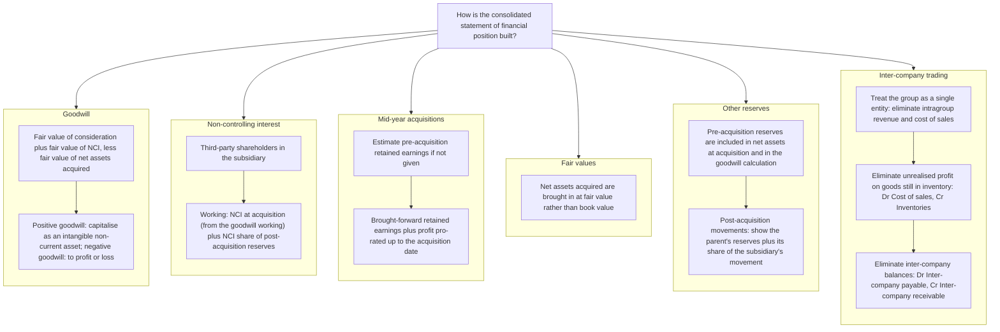

```mermaid
flowchart TB
    R["How is the consolidated statement of financial position built?"]

    subgraph GW["Goodwill"]
        direction TB
        GW1["Fair value of consideration plus fair value of NCI, less fair value of net assets acquired"]
        GW2["Positive goodwill: capitalise as an intangible non-current asset; negative goodwill: to profit or loss"]

        GW1 --> GW2
    end

    subgraph NCI["Non-controlling interest"]
        direction TB
        NC1["Third-party shareholders in the subsidiary"]
        NC2["Working: NCI at acquisition (from the goodwill working) plus NCI share of post-acquisition reserves"]

        NC1 --> NC2
    end

    subgraph MID["Mid-year acquisitions"]
        direction TB
        MD1["Estimate pre-acquisition retained earnings if not given"]
        MD2["Brought-forward retained earnings plus profit pro-rated up to the acquisition date"]

        MD1 --> MD2
    end

    subgraph FV["Fair values"]
        direction TB
        FV1["Net assets acquired are brought in at fair value rather than book value"]

    end

    subgraph ORES["Other reserves"]
        direction TB
        OR1["Pre-acquisition reserves are included in net assets at acquisition and in the goodwill calculation"]
        OR2["Post-acquisition movements: show the parent's reserves plus its share of the subsidiary's movement"]

        OR1 --> OR2
    end

    subgraph ICT["Inter-company trading"]
        direction TB
        IC1["Treat the group as a single entity: eliminate intragroup revenue and cost of sales"]
        IC2["Eliminate unrealised profit on goods still in inventory: Dr Cost of sales, Cr Inventories"]
        IC3["Eliminate inter-company balances: Dr Inter-company payable, Cr Inter-company receivable"]

        IC1 --> IC2
        IC2 --> IC3
    end

    R --> GW
    R --> NCI
    R --> MID
    R --> FV
    R --> ORES
    R --> ICT
```
