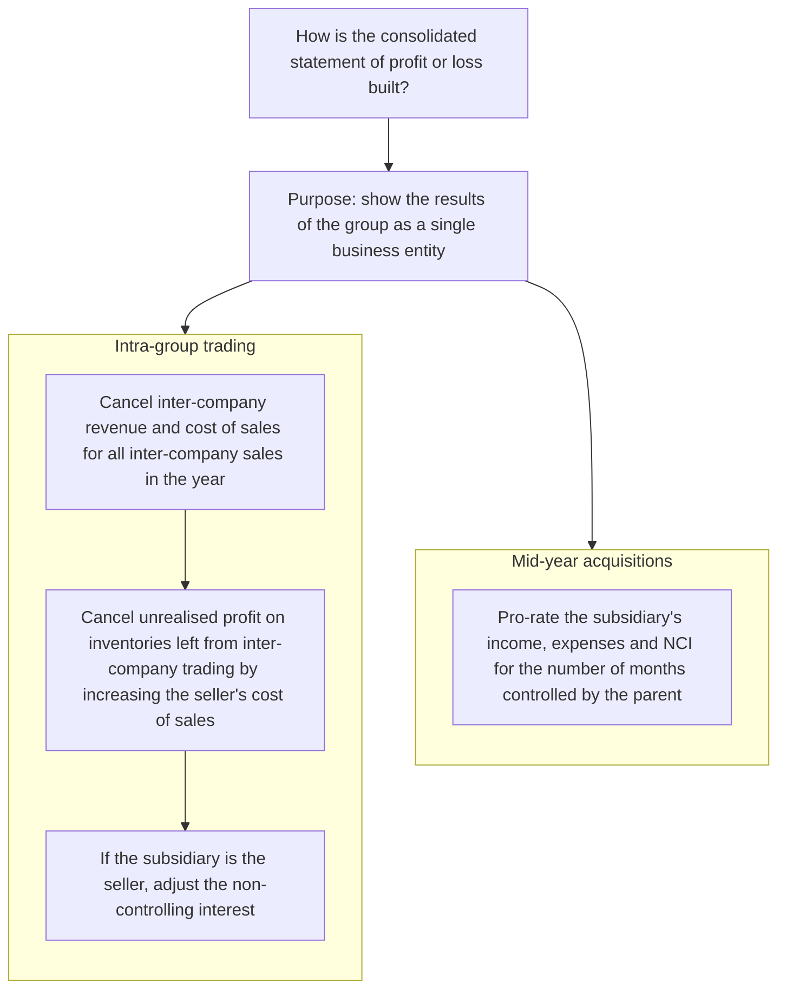

```mermaid
flowchart TB
    R["How is the consolidated statement of profit or loss built?"]

    PUR["Purpose: show the results of the group as a single business entity"]

    subgraph IGT["Intra-group trading"]
        direction TB
        IG1["Cancel inter-company revenue and cost of sales for all inter-company sales in the year"]
        IG2["Cancel unrealised profit on inventories left from inter-company trading by increasing the seller's cost of sales"]
        IG3["If the subsidiary is the seller, adjust the non-controlling interest"]

        IG1 --> IG2
        IG2 --> IG3
    end

    subgraph MID["Mid-year acquisitions"]
        direction TB
        MD1["Pro-rate the subsidiary's income, expenses and NCI for the number of months controlled by the parent"]

    end

    R --> PUR
    PUR --> IGT
    PUR --> MID
```
