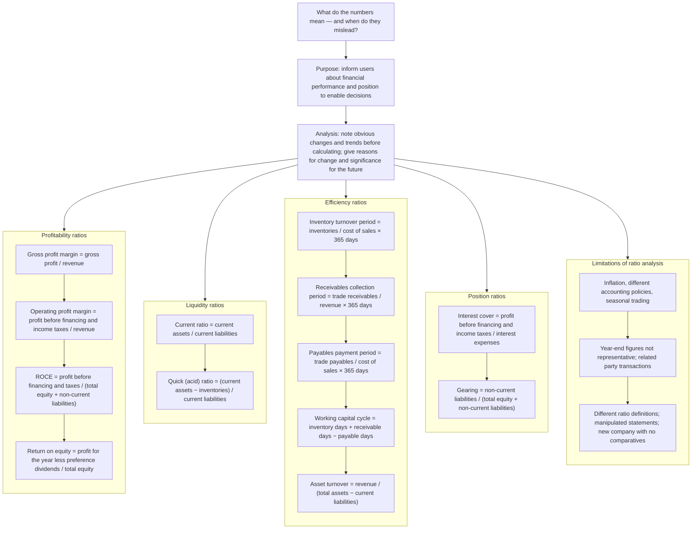

```mermaid
flowchart TB
    R["What do the numbers mean — and when do they mislead?"]

    PUR["Purpose: inform users about financial performance and position to enable decisions"]
    ANA["Analysis: note obvious changes and trends before calculating; give reasons for change and significance for the future"]

    subgraph PROF["Profitability ratios"]
        direction TB
        PF1["Gross profit margin = gross profit / revenue"]
        PF2["Operating profit margin = profit before financing and income taxes / revenue"]
        PF3["ROCE = profit before financing and taxes / (total equity + non-current liabilities)"]
        PF4["Return on equity = profit for the year less preference dividends / total equity"]

        PF1 --> PF2
        PF2 --> PF3
        PF3 --> PF4
    end

    subgraph LIQ["Liquidity ratios"]
        direction TB
        LQ1["Current ratio = current assets / current liabilities"]
        LQ2["Quick (acid) ratio = (current assets − inventories) / current liabilities"]

        LQ1 --> LQ2
    end

    subgraph EFF["Efficiency ratios"]
        direction TB
        EF1["Inventory turnover period = inventories / cost of sales × 365 days"]
        EF2["Receivables collection period = trade receivables / revenue × 365 days"]
        EF3["Payables payment period = trade payables / cost of sales × 365 days"]
        EF4["Working capital cycle = inventory days + receivable days − payable days"]
        EF5["Asset turnover = revenue / (total assets − current liabilities)"]

        EF1 --> EF2
        EF2 --> EF3
        EF3 --> EF4
        EF4 --> EF5
    end

    subgraph POS["Position ratios"]
        direction TB
        PO1["Interest cover = profit before financing and income taxes / interest expenses"]
        PO2["Gearing = non-current liabilities / (total equity + non-current liabilities)"]

        PO1 --> PO2
    end

    subgraph LIM["Limitations of ratio analysis"]
        direction TB
        LM1["Inflation, different accounting policies, seasonal trading"]
        LM2["Year-end figures not representative; related party transactions"]
        LM3["Different ratio definitions; manipulated statements; new company with no comparatives"]

        LM1 --> LM2
        LM2 --> LM3
    end

    R --> PUR
    PUR --> ANA
    ANA --> PROF
    ANA --> LIQ
    ANA --> EFF
    ANA --> POS
    ANA --> LIM
```
