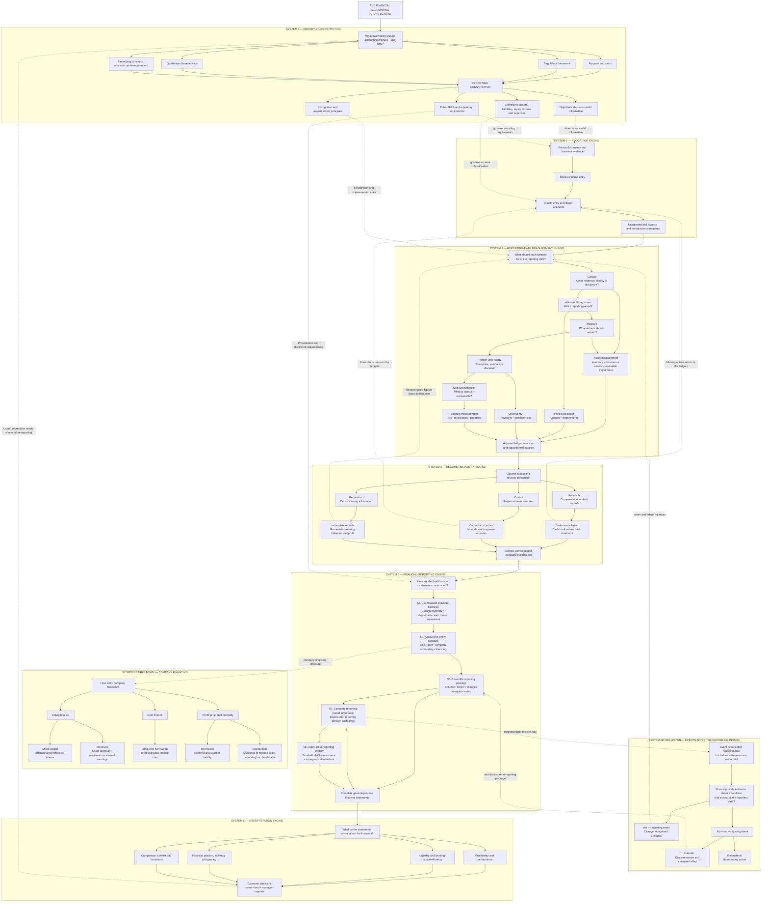

```mermaid
flowchart TB
    ROOT["THE FINANCIAL ACCOUNTING ARCHITECTURE"]

    subgraph SYS1["SYSTEM 1 — REPORTING CONSTITUTION"]
        direction TB

        S1Q["What information should accounting produce—and why?"]

        S11["Purpose and users"]
        S12["Regulatory framework"]
        S13["Qualitative characteristics"]
        S14["Underlying concepts, elements and measurement"]

        S1Q --> S11
        S1Q --> S12
        S1Q --> S13
        S1Q --> S14

        S11 --> CON["REPORTING CONSTITUTION"]
        S12 --> CON
        S13 --> CON
        S14 --> CON

        CON --> C1["Objectives: decision-useful information"]
        CON --> C2["Rules: IFRS and regulatory requirements"]
        CON --> C3["Definitions: assets, liabilities, equity, income and expenses"]
        CON --> C4["Recognition and measurement principles"]
    end

    ROOT --> S1Q

    subgraph SYS2["SYSTEM 2 — RECORDING ENGINE"]
        direction LR

        D["Source documents and business evidence"]
        B["Books of prime entry"]
        L["Double entry and ledger accounts"]
        UTB["Unadjusted trial balance and introductory statements"]

        D --> B --> L --> UTB
    end

    C1 -. "determines useful information" .-> D
    C2 -. "governs recording requirements" .-> D
    C3 -. "governs account classification" .-> L

    subgraph SYS3["SYSTEM 3 — REPORTING-DATE MEASUREMENT ENGINE"]
        direction TB

        M0["What should each balance be at the reporting date?"]

        CL["Classify<br/>Asset, expense, liability or disclosure?"]
        TM["Allocate through time<br/>Which reporting period?"]
        MM["Measure<br/>What amount should remain?"]
        UN["Handle uncertainty<br/>Recognise, estimate or disclose?"]
        BM["Measure balances<br/>What is owed or recoverable?"]

        M1["Asset measurement<br/>Inventory • non-current assets • receivable impairment"]
        M2["Period allocation<br/>Accruals • prepayments"]
        M3["Uncertainty<br/>Provisions • contingencies"]
        M4["Balance measurement<br/>Tax • receivables • payables"]

        M0 --> CL --> TM --> MM --> UN --> BM

        CL --> M1
        TM --> M2
        MM --> M1
        UN --> M3
        BM --> M4

        M1 --> ATB["Adjusted ledger balances and adjusted trial balance"]
        M2 --> ATB
        M3 --> ATB
        M4 --> ATB
    end

    UTB --> M0
    C4 -. "Recognition and measurement rules" .-> M0

    subgraph SYS4["SYSTEM 4 — RECORD RELIABILITY ENGINE"]
        direction TB

        V["Can the accounting records be trusted?"]

        R1["Reconcile<br/>Compare independent records"]
        R2["Correct<br/>Repair erroneous entries"]
        R3["Reconstruct<br/>Derive missing information"]

        V1["Bank reconciliation<br/>Cash book versus bank statement"]
        V2["Correction of errors<br/>Journals and suspense accounts"]
        V3["Incomplete records<br/>Reconstruct missing balances and profit"]

        V --> R1 --> V1
        V --> R2 --> V2
        V --> R3 --> V3

        V1 --> VTB["Verified, corrected and complete trial balance"]
        V2 --> VTB
        V3 --> VTB
    end

    ATB --> V

    V1 -. "Missing entries return to the ledgers" .-> L
    V2 -. "Corrections return to the ledgers" .-> L
    V3 -. "Reconstructed figures return to balances" .-> M0

    subgraph SYS5["SYSTEM 5 — FINANCIAL-REPORTING ENGINE"]
        direction TB

        F["How are the final financial statements constructed?"]

        F5A["5A. Use finalised individual balances<br/>Closing inventory • depreciation • accruals • impairment"]

        F5B["5B. Account for entity structure<br/>Sole trader • company accounting • financing"]

        F5C["5C. Assemble reporting package<br/>SPLOCI • SOFP • changes in equity • notes"]

        F5D["5D. Complete reporting-period information<br/>Events after reporting period • cash flows"]

        F5E["5E. Apply group-reporting overlay<br/>Goodwill • NCI • associates • intra-group eliminations"]

        F --> F5A --> F5B --> F5C --> F5D --> F5E

        F5C --> FS["Complete general-purpose financial statements"]
        F5D --> FS
        F5E --> FS
    end

    VTB --> F
    C2 -. "Presentation and disclosure requirements" .-> F

    subgraph FIN["SYSTEM 5B DRILLDOWN — COMPANY FINANCING"]
        direction TB

        FINQ["How is the company financed?"]

        EQ["Equity finance"]
        DEBT["Debt finance"]
        PROF["Profit generated internally"]

        SH["Share capital<br/>Ordinary and preference shares"]
        RES["Reserves<br/>Share premium • revaluation • retained earnings"]
        BOR["Long-term borrowings<br/>Interest creates finance cost"]
        TAX["Income tax<br/>Expense plus current liability"]
        DIV["Distributions<br/>Dividends or finance costs, depending on classification"]

        FINQ --> EQ
        FINQ --> DEBT
        FINQ --> PROF

        EQ --> SH
        EQ --> RES
        DEBT --> BOR
        PROF --> TAX
        PROF --> DIV
    end

    F5B -. "company-financing structure" .-> FINQ

    subgraph EVENTS["SYSTEM 5D DRILLDOWN — EVENTS AFTER THE REPORTING PERIOD"]
        direction TB

        EV["Event occurs after reporting date<br/>but before statements are authorised"]

        Q["Does it provide evidence about a condition<br/>that existed at the reporting date?"]

        ADJ["Yes — adjusting event<br/>Change recognised amounts"]
        NADJ["No — non-adjusting event"]
        MAT["If material<br/>Disclose nature and estimated effect"]
        IMM["If immaterial<br/>No reporting action"]

        EV --> Q
        Q --> ADJ
        Q --> NADJ
        NADJ --> MAT
        NADJ --> IMM
    end

    F5D -. "reporting-date decision rule" .-> EV
    ADJ -. "return and adjust balances" .-> M0
    MAT -. "add disclosure to reporting package" .-> F5C

    subgraph SYS6["SYSTEM 6 — INTERPRETATION ENGINE"]
        direction TB

        I["What do the statements reveal about the business?"]

        I1["Profitability and performance"]
        I2["Liquidity and working-capital efficiency"]
        I3["Financial position, solvency and gearing"]
        I4["Comparison, context and limitations"]

        I --> I1
        I --> I2
        I --> I3
        I --> I4

        I1 --> DEC["Economic decisions<br/>Invest • lend • manage • regulate"]
        I2 --> DEC
        I3 --> DEC
        I4 --> DEC
    end

    FS --> I
    DEC -. "Users' information needs shape future reporting" .-> S1Q
```