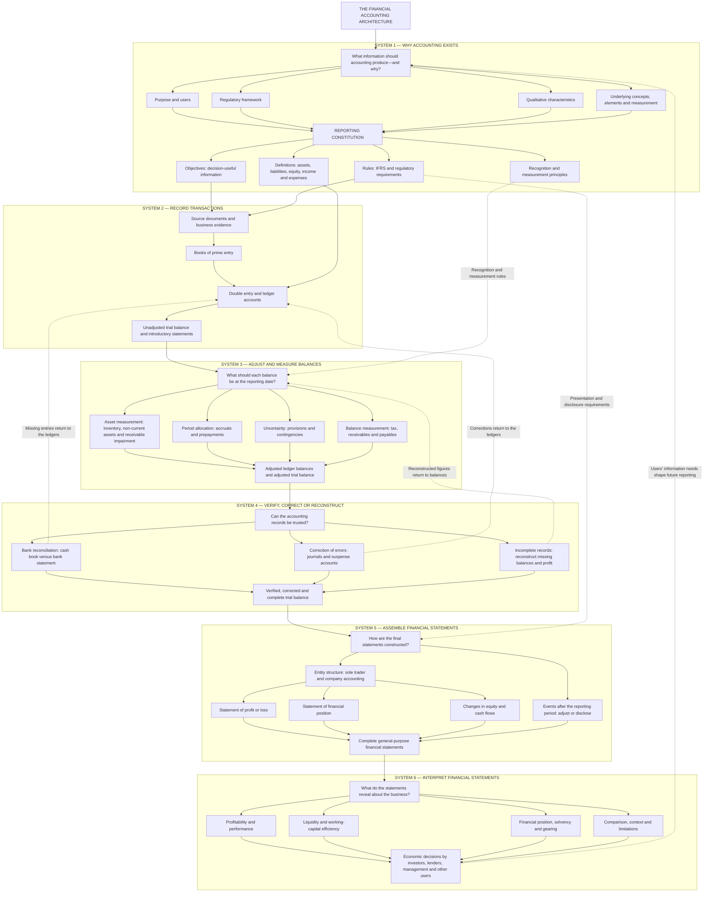

```mermaid
flowchart TB
    A["THE FINANCIAL ACCOUNTING ARCHITECTURE"]

    subgraph SYS1["SYSTEM 1 — WHY ACCOUNTING EXISTS"]
        direction TB

        S1["What information should accounting produce—and why?"]

        S11["Purpose and users"]
        S12["Regulatory framework"]
        S13["Qualitative characteristics"]
        S14["Underlying concepts, elements and measurement"]

        S1 --> S11
        S1 --> S12
        S1 --> S13
        S1 --> S14

        S11 --> C["REPORTING CONSTITUTION"]
        S12 --> C
        S13 --> C
        S14 --> C

        C --> C1["Objectives: decision-useful information"]
        C --> C2["Rules: IFRS and regulatory requirements"]
        C --> C3["Definitions: assets, liabilities, equity, income and expenses"]
        C --> C4["Recognition and measurement principles"]
    end

    A --> S1

    subgraph SYS2["SYSTEM 2 — RECORD TRANSACTIONS"]
        direction LR

        D["Source documents and business evidence"]
        B["Books of prime entry"]
        L["Double entry and ledger accounts"]
        U["Unadjusted trial balance and introductory statements"]

        D --> B --> L --> U
    end

    C1 --> D
    C2 --> D
    C3 --> L

    subgraph SYS3["SYSTEM 3 — ADJUST AND MEASURE BALANCES"]
        direction TB

        M["What should each balance be at the reporting date?"]

        M1["Asset measurement: inventory, non-current assets and receivable impairment"]
        M2["Period allocation: accruals and prepayments"]
        M3["Uncertainty: provisions and contingencies"]
        M4["Balance measurement: tax, receivables and payables"]

        M --> M1
        M --> M2
        M --> M3
        M --> M4

        M1 --> ATB["Adjusted ledger balances and adjusted trial balance"]
        M2 --> ATB
        M3 --> ATB
        M4 --> ATB
    end

    U --> M
    C4 -. "Recognition and measurement rules" .-> M

    subgraph SYS4["SYSTEM 4 — VERIFY, CORRECT OR RECONSTRUCT"]
        direction TB

        V["Can the accounting records be trusted?"]

        V1["Bank reconciliation: cash book versus bank statement"]
        V2["Correction of errors: journals and suspense accounts"]
        V3["Incomplete records: reconstruct missing balances and profit"]

        V --> V1
        V --> V2
        V --> V3

        V1 --> CTB["Verified, corrected and complete trial balance"]
        V2 --> CTB
        V3 --> CTB
    end

    ATB --> V

    V1 -. "Missing entries return to the ledgers" .-> L
    V2 -. "Corrections return to the ledgers" .-> L
    V3 -. "Reconstructed figures return to balances" .-> M

    subgraph SYS5["SYSTEM 5 — ASSEMBLE FINANCIAL STATEMENTS"]
        direction TB

        F["How are the final statements constructed?"]

        F1["Entity structure: sole trader and company accounting"]
        F2["Statement of profit or loss"]
        F3["Statement of financial position"]
        F4["Changes in equity and cash flows"]
        F5["Events after the reporting period: adjust or disclose"]

        F --> F1
        F1 --> F2
        F1 --> F3
        F1 --> F4
        F --> F5

        F2 --> FS["Complete general-purpose financial statements"]
        F3 --> FS
        F4 --> FS
        F5 --> FS
    end

    CTB --> F
    C2 -. "Presentation and disclosure requirements" .-> F

    subgraph SYS6["SYSTEM 6 — INTERPRET FINANCIAL STATEMENTS"]
        direction TB

        I["What do the statements reveal about the business?"]

        I1["Profitability and performance"]
        I2["Liquidity and working-capital efficiency"]
        I3["Financial position, solvency and gearing"]
        I4["Comparison, context and limitations"]

        I --> I1
        I --> I2
        I --> I3
        I --> I4

        I1 --> DEC["Economic decisions by investors, lenders, management and other users"]
        I2 --> DEC
        I3 --> DEC
        I4 --> DEC
    end

    FS --> I
    DEC -. "Users' information needs shape future reporting" .-> S1
```
