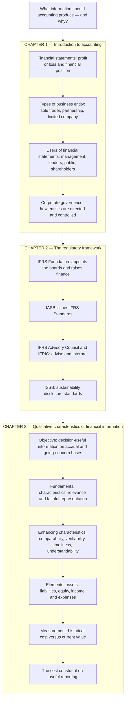

```mermaid
flowchart TB
    Q["What information should accounting produce — and why?"]

    subgraph CH1["CHAPTER 1 — Introduction to accounting"]
        direction TB
        CH1A["Financial statements: profit or loss and financial position"]
        CH1B["Types of business entity: sole trader, partnership, limited company"]
        CH1C["Users of financial statements: management, lenders, public, shareholders"]
        CH1D["Corporate governance: how entities are directed and controlled"]

        CH1A --> CH1B
        CH1B --> CH1C
        CH1C --> CH1D
    end

    subgraph CH2["CHAPTER 2 — The regulatory framework"]
        direction TB
        CH2A["IFRS Foundation: appoints the boards and raises finance"]
        CH2B["IASB issues IFRS Standards"]
        CH2C["IFRS Advisory Council and IFRIC: advise and interpret"]
        CH2D["ISSB: sustainability disclosure standards"]

        CH2A --> CH2B
        CH2B --> CH2C
        CH2C --> CH2D
    end

    subgraph CH3["CHAPTER 3 — Qualitative characteristics of financial information"]
        direction TB
        CH3A["Objective: decision-useful information on accrual and going-concern bases"]
        CH3B["Fundamental characteristics: relevance and faithful representation"]
        CH3C["Enhancing characteristics: comparability, verifiability, timeliness, understandability"]
        CH3D["Elements: assets, liabilities, equity, income and expenses"]
        CH3E["Measurement: historical cost versus current value"]
        CH3F["The cost constraint on useful reporting"]

        CH3A --> CH3B
        CH3B --> CH3C
        CH3C --> CH3D
        CH3D --> CH3E
        CH3E --> CH3F
    end

    Q --> CH1
    CH1 --> CH2
    CH2 --> CH3
```
