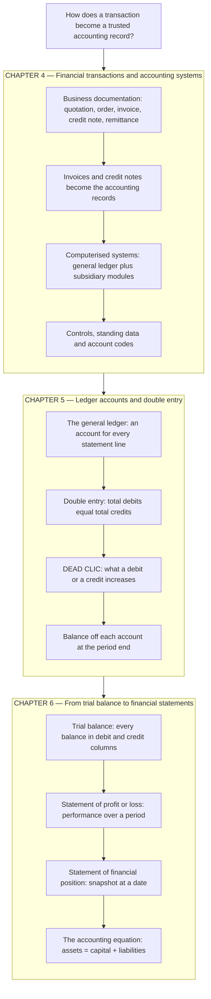

```mermaid
flowchart TB
    Q["How does a transaction become a trusted accounting record?"]

    subgraph CH4["CHAPTER 4 — Financial transactions and accounting systems"]
        direction TB
        CH4A["Business documentation: quotation, order, invoice, credit note, remittance"]
        CH4B["Invoices and credit notes become the accounting records"]
        CH4C["Computerised systems: general ledger plus subsidiary modules"]
        CH4D["Controls, standing data and account codes"]

        CH4A --> CH4B
        CH4B --> CH4C
        CH4C --> CH4D
    end

    subgraph CH5["CHAPTER 5 — Ledger accounts and double entry"]
        direction TB
        CH5A["The general ledger: an account for every statement line"]
        CH5B["Double entry: total debits equal total credits"]
        CH5C["DEAD CLIC: what a debit or a credit increases"]
        CH5D["Balance off each account at the period end"]

        CH5A --> CH5B
        CH5B --> CH5C
        CH5C --> CH5D
    end

    subgraph CH6["CHAPTER 6 — From trial balance to financial statements"]
        direction TB
        CH6A["Trial balance: every balance in debit and credit columns"]
        CH6B["Statement of profit or loss: performance over a period"]
        CH6C["Statement of financial position: snapshot at a date"]
        CH6D["The accounting equation: assets = capital + liabilities"]

        CH6A --> CH6B
        CH6B --> CH6C
        CH6C --> CH6D
    end

    Q --> CH4
    CH4 --> CH5
    CH5 --> CH6
```
