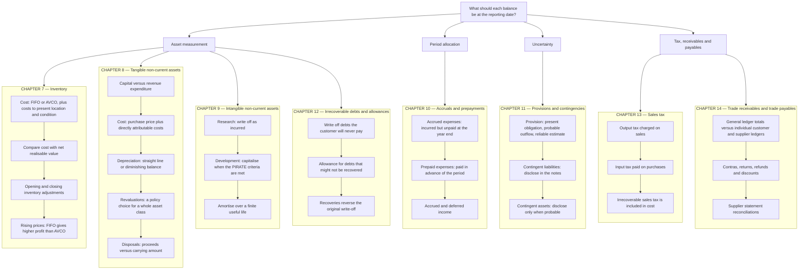

```mermaid
flowchart TB
    Q["What should each balance be at the reporting date?"]

    T1["Asset measurement"]
    T2["Period allocation"]
    T3["Uncertainty"]
    T4["Tax, receivables and payables"]

    Q --> T1
    Q --> T2
    Q --> T3
    Q --> T4

    subgraph CH7["CHAPTER 7 — Inventory"]
        direction TB
        CH7A["Cost: FIFO or AVCO, plus costs to present location and condition"]
        CH7B["Compare cost with net realisable value"]
        CH7C["Opening and closing inventory adjustments"]
        CH7D["Rising prices: FIFO gives higher profit than AVCO"]

        CH7A --> CH7B
        CH7B --> CH7C
        CH7C --> CH7D
    end

    subgraph CH8["CHAPTER 8 — Tangible non-current assets"]
        direction TB
        CH8A["Capital versus revenue expenditure"]
        CH8B["Cost: purchase price plus directly attributable costs"]
        CH8C["Depreciation: straight line or diminishing balance"]
        CH8D["Revaluations: a policy choice for a whole asset class"]
        CH8E["Disposals: proceeds versus carrying amount"]

        CH8A --> CH8B
        CH8B --> CH8C
        CH8C --> CH8D
        CH8D --> CH8E
    end

    subgraph CH9["CHAPTER 9 — Intangible non-current assets"]
        direction TB
        CH9A["Research: write off as incurred"]
        CH9B["Development: capitalise when the PIRATE criteria are met"]
        CH9C["Amortise over a finite useful life"]

        CH9A --> CH9B
        CH9B --> CH9C
    end

    subgraph CH12["CHAPTER 12 — Irrecoverable debts and allowances"]
        direction TB
        CH12A["Write off debts the customer will never pay"]
        CH12B["Allowance for debts that might not be recovered"]
        CH12C["Recoveries reverse the original write-off"]

        CH12A --> CH12B
        CH12B --> CH12C
    end

    subgraph CH10["CHAPTER 10 — Accruals and prepayments"]
        direction TB
        CH10A["Accrued expenses: incurred but unpaid at the year end"]
        CH10B["Prepaid expenses: paid in advance of the period"]
        CH10C["Accrued and deferred income"]

        CH10A --> CH10B
        CH10B --> CH10C
    end

    subgraph CH11["CHAPTER 11 — Provisions and contingencies"]
        direction TB
        CH11A["Provision: present obligation, probable outflow, reliable estimate"]
        CH11B["Contingent liabilities: disclose in the notes"]
        CH11C["Contingent assets: disclose only when probable"]

        CH11A --> CH11B
        CH11B --> CH11C
    end

    subgraph CH13["CHAPTER 13 — Sales tax"]
        direction TB
        CH13A["Output tax charged on sales"]
        CH13B["Input tax paid on purchases"]
        CH13C["Irrecoverable sales tax is included in cost"]

        CH13A --> CH13B
        CH13B --> CH13C
    end

    subgraph CH14["CHAPTER 14 — Trade receivables and trade payables"]
        direction TB
        CH14A["General ledger totals versus individual customer and supplier ledgers"]
        CH14B["Contras, returns, refunds and discounts"]
        CH14C["Supplier statement reconciliations"]

        CH14A --> CH14B
        CH14B --> CH14C
    end

    T1 --> CH7
    T1 --> CH8
    T1 --> CH9
    T1 --> CH12
    T2 --> CH10
    T3 --> CH11
    T4 --> CH13
    T4 --> CH14
```
