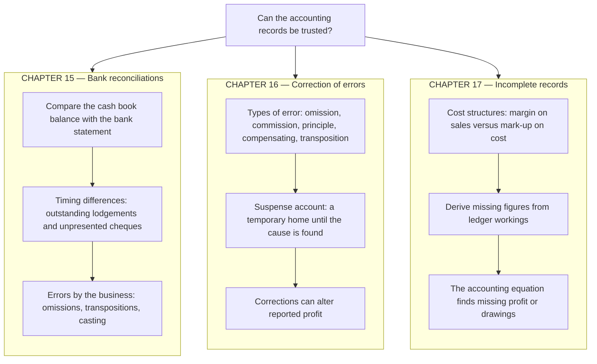

```mermaid
flowchart TB
    Q["Can the accounting records be trusted?"]

    subgraph CH15["CHAPTER 15 — Bank reconciliations"]
        direction TB
        CH15A["Compare the cash book balance with the bank statement"]
        CH15B["Timing differences: outstanding lodgements and unpresented cheques"]
        CH15C["Errors by the business: omissions, transpositions, casting"]

        CH15A --> CH15B
        CH15B --> CH15C
    end

    subgraph CH16["CHAPTER 16 — Correction of errors"]
        direction TB
        CH16A["Types of error: omission, commission, principle, compensating, transposition"]
        CH16B["Suspense account: a temporary home until the cause is found"]
        CH16C["Corrections can alter reported profit"]

        CH16A --> CH16B
        CH16B --> CH16C
    end

    subgraph CH17["CHAPTER 17 — Incomplete records"]
        direction TB
        CH17A["Cost structures: margin on sales versus mark-up on cost"]
        CH17B["Derive missing figures from ledger workings"]
        CH17C["The accounting equation finds missing profit or drawings"]

        CH17A --> CH17B
        CH17B --> CH17C
    end

    Q --> CH15
    Q --> CH16
    Q --> CH17
```
