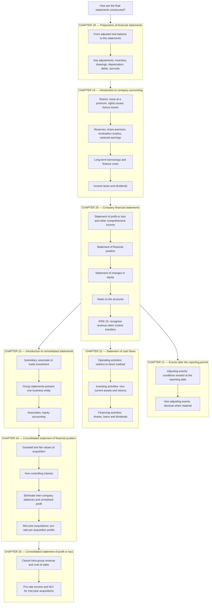

```mermaid
flowchart TB
    Q["How are the final statements constructed?"]

    subgraph CH18["CHAPTER 18 — Preparation of financial statements"]
        direction TB
        CH18A["From adjusted trial balance to the statements"]
        CH18B["Key adjustments: inventory, drawings, depreciation, debts, accruals"]

        CH18A --> CH18B
    end

    subgraph CH19["CHAPTER 19 — Introduction to company accounting"]
        direction TB
        CH19A["Shares: issue at a premium, rights issues, bonus issues"]
        CH19B["Reserves: share premium, revaluation surplus, retained earnings"]
        CH19C["Long-term borrowings and finance costs"]
        CH19D["Income taxes and dividends"]

        CH19A --> CH19B
        CH19B --> CH19C
        CH19C --> CH19D
    end

    subgraph CH20["CHAPTER 20 — Company financial statements"]
        direction TB
        CH20A["Statement of profit or loss and other comprehensive income"]
        CH20B["Statement of financial position"]
        CH20C["Statement of changes in equity"]
        CH20D["Notes to the accounts"]
        CH20E["IFRS 15: recognise revenue when control transfers"]

        CH20A --> CH20B
        CH20B --> CH20C
        CH20C --> CH20D
        CH20D --> CH20E
    end

    subgraph CH21["CHAPTER 21 — Events after the reporting period"]
        direction TB
        CH21A["Adjusting events: conditions existed at the reporting date"]
        CH21B["Non-adjusting events: disclose when material"]

        CH21A --> CH21B
    end

    subgraph CH22["CHAPTER 22 — Statement of cash flows"]
        direction TB
        CH22A["Operating activities: indirect or direct method"]
        CH22B["Investing activities: non-current assets and returns"]
        CH22C["Financing activities: shares, loans and dividends"]

        CH22A --> CH22B
        CH22B --> CH22C
    end

    subgraph CH23["CHAPTER 23 — Introduction to consolidated statements"]
        direction TB
        CH23A["Subsidiary, associate or trade investment"]
        CH23B["Group statements present one business entity"]
        CH23C["Associates: equity accounting"]

        CH23A --> CH23B
        CH23B --> CH23C
    end

    subgraph CH24["CHAPTER 24 — Consolidated statement of financial position"]
        direction TB
        CH24A["Goodwill and fair values at acquisition"]
        CH24B["Non-controlling interest"]
        CH24C["Eliminate inter-company balances and unrealised profit"]
        CH24D["Mid-year acquisitions: pro-rate pre-acquisition profits"]

        CH24A --> CH24B
        CH24B --> CH24C
        CH24C --> CH24D
    end

    subgraph CH25["CHAPTER 25 — Consolidated statement of profit or loss"]
        direction TB
        CH25A["Cancel intra-group revenue and cost of sales"]
        CH25B["Pro-rate income and NCI for mid-year acquisitions"]

        CH25A --> CH25B
    end

    Q --> CH18
    CH18 --> CH19
    CH19 --> CH20
    CH20 --> CH21
    CH20 --> CH22
    CH20 --> CH23
    CH23 --> CH24
    CH24 --> CH25
```
