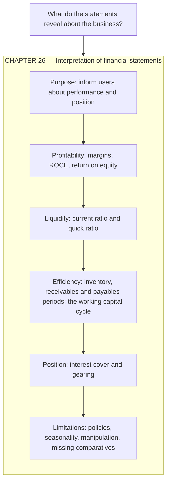

```mermaid
flowchart TB
    Q["What do the statements reveal about the business?"]

    subgraph CH26["CHAPTER 26 — Interpretation of financial statements"]
        direction TB
        CH26A["Purpose: inform users about performance and position"]
        CH26B["Profitability: margins, ROCE, return on equity"]
        CH26C["Liquidity: current ratio and quick ratio"]
        CH26D["Efficiency: inventory, receivables and payables periods; the working capital cycle"]
        CH26E["Position: interest cover and gearing"]
        CH26F["Limitations: policies, seasonality, manipulation, missing comparatives"]

        CH26A --> CH26B
        CH26B --> CH26C
        CH26C --> CH26D
        CH26D --> CH26E
        CH26E --> CH26F
    end

    Q --> CH26
```
