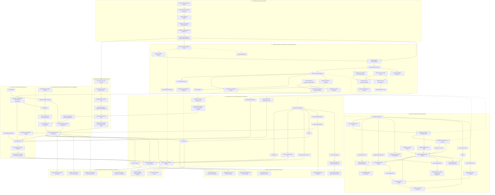

```mermaid
flowchart TB
    subgraph ORIGIN["1 — Economic reason the system exists"]
        direction TB
        O1["Trade, credit, property and taxation"]
        O2["Large enterprises and long-lived projects"]
        O3["Capital supplied by outsiders"]
        O4["Separation of ownership and management"]
        O5["Information asymmetry and agency risk"]
        O6["Need for stewardship and decision-useful information"]

        O1 --> O2
        O2 --> O3
        O3 --> O4
        O4 --> O5
        O5 --> O6
    end

    subgraph REPORTING["2 — Accounting information-production system"]
        direction TB
        R1["Economic events and contracts"]
        R2["Source documents and internal controls"]
        R3["Bookkeeping and double entry"]
        R4["Accounting policies, estimates and judgements"]
        R5["Financial statements and notes"]
        R6["Comparable information over time and between entities"]

        R1 --> R2
        R2 --> R3
        R3 --> R4
        R4 --> R5
        R5 --> R6
    end

    O6 --> R1

    subgraph GLOBAL["3 — Global coordination: influential but not sovereign government"]
        direction TB

        G1["G20 and Financial Stability Board"]
        G2["IOSCO: securities regulators"]
        G3["BIS and Basel Committee"]
        G4["IMF and World Bank"]
        G5["OECD and international tax coordination"]

        MB["IFRS Foundation Monitoring Board"]
        TR["IFRS Foundation Trustees"]
        IASB["IASB: accounting standards"]
        ISSB["ISSB: sustainability disclosures"]
        IC["IFRS Interpretations Committee"]
        CF["Conceptual Framework"]
        IFAMILY["IAS, IFRS, SIC and IFRIC materials"]
        SME["IFRS for SMEs"]

        IFEA["International Foundation for Ethics and Audit"]
        PIOB["Public Interest Oversight Board"]
        IAASB["IAASB: audit and assurance standards"]
        IESBA["IESBA: ethics and independence"]
        ISA["International Standards on Auditing"]
        ETH["International ethics code"]

        IFAC["IFAC: federation of accountancy organisations"]
        IPSASB["IPSASB: public-sector accounting"]
        PROFNET["National and international professional bodies"]

        G1 -.-> G2
        G1 -.-> G3
        G1 -.-> G4
        G2 --> MB
        MB --> TR
        TR --> IASB
        TR --> ISSB
        IASB --> CF
        IASB --> IFAMILY
        IASB --> SME
        IASB --> IC
        IC --> IFAMILY

        IFEA --> IAASB
        IFEA --> IESBA
        PIOB --> IAASB
        PIOB --> IESBA
        IAASB --> ISA
        IESBA --> ETH

        IFAC --> PROFNET
        IFAC --> IPSASB
    end

    O6 --> G1
    O6 --> MB

    subgraph SOVEREIGN["4 — Sovereign country: where standards become compulsory"]
        direction TB

        P["Parliament or legislature"]
        CL["Company law"]
        SL["Securities and exchange law"]
        BL["Banking and insurance law"]
        TL["Tax law"]
        PL["Audit and professional law"]
        CRL["Civil and criminal law"]

        NSS["National accounting standard setter"]
        NGAAP["National GAAP, endorsed IFRS or converged standards"]
        NAS["National audit standards"]
        NE["National ethics and independence rules"]

        REG["Company registrar"]
        SEC["Securities regulator and stock exchange"]
        PRU["Central bank or prudential regulator"]
        TAX["Tax authority"]
        AREG["Audit oversight regulator"]
        COURT["Courts, prosecutors and enforcement agencies"]

        P --> CL
        P --> SL
        P --> BL
        P --> TL
        P --> PL
        P --> CRL

        CL --> REG
        SL --> SEC
        BL --> PRU
        TL --> TAX
        PL --> AREG
        CRL --> COURT

        IFAMILY -.-> NSS
        SME -.-> NSS
        NSS --> NGAAP
        ISA -.-> NAS
        ETH -.-> NE
        G3 -.-> PRU
        G5 -.-> TAX
    end

    GLOBAL -.-> P

    subgraph ENTITY["5 — Reporting entity: primary responsibility remains with management"]
        direction TB

        OWN["Shareholders and capital providers"]
        BOARD["Board and audit committee"]
        MGMT["Management"]
        ICNTL["Internal controls and accounting systems"]
        POL["Policies, estimates and professional judgement"]
        ACCOUNTS["General ledger and consolidation"]
        FS["Financial statements and disclosures"]
        DECL["Directors approve and take responsibility"]

        OWN --> BOARD
        BOARD --> MGMT
        MGMT --> ICNTL
        NGAAP --> POL
        ICNTL --> ACCOUNTS
        POL --> ACCOUNTS
        ACCOUNTS --> FS
        BOARD --> DECL
        DECL --> FS
    end

    R6 --> FS

    subgraph ASSURANCE["6 — Assurance and professional infrastructure"]
        direction TB

        INT["Internal audit"]
        EXT["External auditor"]
        EVID["Audit evidence and risk assessment"]
        OP["Audit opinion: reasonable, not absolute, assurance"]
        QA["Firm quality management"]
        OV["Inspection and disciplinary oversight"]
        EDU["Education, examinations and continuing development"]

        INT --> BOARD
        NAS --> EXT
        NE --> EXT
        FS --> EXT
        EXT --> EVID
        EVID --> OP
        QA --> EXT
        AREG --> OV
        OV --> EXT
        PROFNET --> EDU
        EDU --> EXT
        EDU --> MGMT
    end

    subgraph ENFORCEMENT["7 — Different authorities protect different interests"]
        direction TB

        E1["Company filing and corporate accountability"]
        E2["Market disclosure and investor protection"]
        E3["Depositor, policyholder and systemic stability"]
        E4["Tax assessment and government revenue"]
        E5["Audit quality and public confidence"]
        E6["Civil remedies, penalties and criminal prosecution"]

        REG --> E1
        SEC --> E2
        PRU --> E3
        TAX --> E4
        AREG --> E5
        COURT --> E6

        FS --> REG
        FS --> SEC
        FS --> PRU
        FS --> TAX
        OP --> REG
        OP --> SEC
        OP --> PRU
    end

    subgraph USERS["8 — Users make different decisions from the same reporting base"]
        direction TB

        U1["Equity investors: value and stewardship"]
        U2["Lenders: credit risk and covenant compliance"]
        U3["Suppliers and employees: continuity and claims"]
        U4["Tax authority: taxable income"]
        U5["Prudential regulator: capital, liquidity and solvency"]
        U6["Government and public: policy and accountability"]

        FS --> U1
        FS --> U2
        FS --> U3
        TAX --> U4
        PRU --> U5
        REG --> U6
    end

    subgraph MALAYSIA["9 — Malaysia: detailed national implementation"]
        direction TB

        MYP["Parliament of Malaysia"]

        FRA["Financial Reporting Act 1997"]
        MASB["Malaysian Accounting Standards Board"]
        MFRS["MFRS Framework: IFRS-equivalent"]
        MPERS["MPERS: eligible private entities"]
        M137["MFRS 137 = IAS 37"]

        CA["Companies Act 2016"]
        SSM["SSM: Registrar and corporate compliance"]

        CMS["Capital-markets legislation"]
        SCM["Securities Commission Malaysia"]
        BURSA["Bursa Malaysia listing requirements"]
        AOB["Audit Oversight Board"]

        FINLAW["Central-bank and financial-sector legislation"]
        BNM["Bank Negara Malaysia"]
        PRURET["Prudential returns, capital and supervisory adjustments"]

        ITA["Income Tax Act 1967"]
        LHDN["LHDN"]
        TAXCOMP["Tax computation and statutory adjustments"]

        AA["Accountants Act 1967"]
        MIA["Malaysian Institute of Accountants"]

        MYBOARD["Malaysian company directors"]
        MYFS["MFRS or MPERS financial statements"]
        MYAUD["External audit where required"]
        MYMARKET["Investors, lenders and other users"]

        MYP --> FRA
        FRA --> MASB
        IASB -.-> MASB
        MASB --> MFRS
        MASB --> MPERS
        IFAMILY -.-> MFRS
        MFRS --> M137

        MYP --> CA
        CA --> SSM

        MYP --> CMS
        CMS --> SCM
        SCM --> BURSA
        SCM --> AOB

        MYP --> FINLAW
        FINLAW --> BNM
        BNM --> PRURET

        MYP --> ITA
        ITA --> LHDN
        LHDN --> TAXCOMP

        MYP --> AA
        AA --> MIA

        MFRS --> MYFS
        MPERS --> MYFS
        M137 --> MYFS
        MYBOARD --> MYFS
        MYFS --> MYAUD
        AOB --> MYAUD
        MIA --> MYAUD

        MYFS --> SSM
        MYFS --> SCM
        MYFS --> BNM
        MYFS --> TAXCOMP
        MYFS --> MYMARKET
        MYAUD --> MYMARKET
    end

    SOVEREIGN -.-> MYP
```