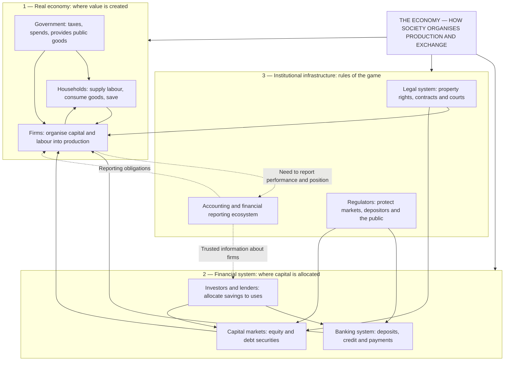

```mermaid
flowchart TB
    ECO["THE ECONOMY — HOW SOCIETY ORGANISES PRODUCTION AND EXCHANGE"]

    subgraph REAL["1 — Real economy: where value is created"]
        direction TB
        HH["Households: supply labour, consume goods, save"]
        FIRMS["Firms: organise capital and labour into production"]
        GOV["Government: taxes, spends, provides public goods"]

        HH --> FIRMS
        FIRMS --> HH
        GOV --> HH
        GOV --> FIRMS
    end

    subgraph FIN["2 — Financial system: where capital is allocated"]
        direction TB
        BANK["Banking system: deposits, credit and payments"]
        MKT["Capital markets: equity and debt securities"]
        INV["Investors and lenders: allocate savings to uses"]

        INV --> BANK
        INV --> MKT
        BANK --> FIRMS
        MKT --> FIRMS
    end

    subgraph INST["3 — Institutional infrastructure: rules of the game"]
        direction TB
        LEGAL["Legal system: property rights, contracts and courts"]
        ACC["Accounting and financial reporting ecosystem"]
        REGU["Regulators: protect markets, depositors and the public"]
    end

    ECO --> REAL
    ECO --> FIN
    ECO --> INST

    LEGAL --> FIRMS
    LEGAL --> MKT
    ACC -. "Trusted information about firms" .-> INV
    ACC -. "Reporting obligations" .-> FIRMS
    REGU --> BANK
    REGU --> MKT

    FIRMS -. "Need to report performance and position" .-> ACC
```
